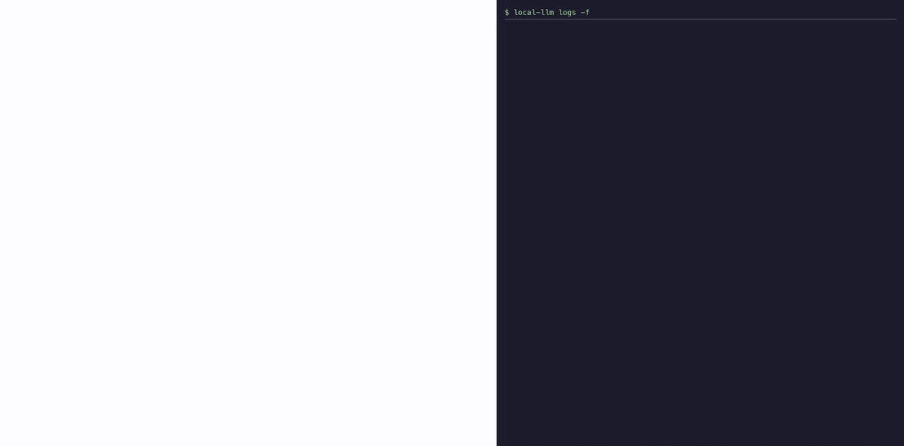

# local-llm

`local-llm` runs one `llama-server` process — the inference server from
[llama.cpp](https://github.com/ggml-org/llama.cpp) — that serves every model listed in a
config file, on one port. It is for anyone who wants several local models available at
once without hand-tuning each one. Models are packaged as **GGUF** files, a single-file
format holding weights, tokenizer and metadata; since December 2025 `llama-server` has had
a *router mode*, where an INI file names each model and one endpoint serves all of them,
loading whichever the request asks for. `local-llm` sits on top of that: it detects your
machine, recommends models that actually fit, downloads and tunes them, starts and stops
the router, and points coding agents at it. It runs on macOS and Linux; Windows is untested.

## Why not Ollama or LM Studio

Both get a model running locally, but each hides llama.cpp behind its own model format and
application. `llama-server`'s router mode already gives you the same one-endpoint,
many-models arrangement, with no app of its own. What `local-llm` adds on top is the
machine-aware model suggestions, the tuning, and the agent wiring — while the config stays
a plain llama.cpp INI file you can read and edit by hand.

## Getting started

```
curl -fsSL https://raw.githubusercontent.com/Nikontem/local-llm/main/install.sh | sh
local-llm setup
```

The script installs the tool with [`uv`](https://astral.sh/uv), installing `uv` itself
first if needed. If you would rather not pipe a script into a shell, `uv tool install
git+https://github.com/Nikontem/local-llm` does the same job; either way, `local-llm setup`
is the next step.

See [docs/setup.md](https://github.com/Nikontem/local-llm/blob/main/docs/setup.md) for the
Homebrew question, the upgrade path, and the seven setup steps in detail.

## What `setup` does to your machine

It checks prerequisites, measures your machine and turns that into a memory budget,
suggests models that fit and downloads the ones you pick, writes a tuned section for each
into `models.ini`, offers to wire up whichever coding agents it finds installed, and starts
the router. Nothing is downloaded or overwritten without asking, and the wizard can be
re-run at any time — each step detects what is already done and skips it.


## What you get

```
Local LLM router

  state:    running
  pid:      52995
  url:      http://127.0.0.1:5678/v1
  health:   {"status":"ok"}
  config:   /Users/you/.config/local-llm/models.ini

  loaded models:  none resident
```

The router serves an OpenAI-style endpoint at `http://127.0.0.1:5678/v1` and an
Anthropic-style one at `http://127.0.0.1:5678`. Any model named in `models.ini` can be
asked for by name in the `model` field of a request, with no restart.



## The commands

One line each; flags, options and output samples are in
[docs/commands.md](https://github.com/Nikontem/local-llm/blob/main/docs/commands.md).

**Running the router**

| Command | Does |
|---|---|
| `up` | Starts the router detached. |
| `down` | Stops the router and every model process under it. |
| `restart` | Down, then up, reloading whatever was resident. |
| `status` | What is running and loaded right now (the default command). |
| `logs` | Follows or tails the current log. |
| `ui` | Opens `llama-server`'s own web interface. |

**Models**

| Command | Does |
|---|---|
| `models` | Lists every model in `models.ini` with its size on disk. |
| `load` | Preloads one or more models. |
| `unload` | Releases a model immediately. |
| `recommend` | Suggests models that fit this machine. |
| `search` | Free-text search of GGUF repositories on Hugging Face. |
| `pull` | Downloads a model and writes a tuned config section. |
| `add` | Registers a GGUF file you already have on disk. |
| `remove` | Removes a model's config section, and optionally its files. |
| `edit` | Opens `models.ini` in `$EDITOR`. |

**Coding agents**

| Command | Does |
|---|---|
| `integrate` | Wires up whichever coding agents are installed. |
| `claude`, `copilot`, `aider`, `qwen` | Starts that agent pointed at the router. |
| `env` | Prints the environment variables for any other tool. |

**Setup and maintenance**

| Command | Does |
|---|---|
| `setup` | The guided first-run wizard. |
| `doctor` | Checks prerequisites and current state. |
| `completion install` | Installs shell completion and the `local_llm` alias. |
| `prune-logs` | Deletes rotated logs older than N days (default 30). |
| `uninstall` | Undoes what the tool put on the machine. |

## Coding agents

An agent gets wired up one of two ways: a provider written into the agent's own
configuration file, so it always offers the router's models, or a launcher command that
sets the right environment variables and starts the agent. `local-llm integrate` (also
step 6 of `setup`) does the first kind; the commands above do the second.

| Agent | How | Command or alias |
|---|---|---|
| OpenAI Codex CLI | configured in agent (**experimental**) | `codex --profile local-llm` / `codex_local` |
| opencode | configured in agent | plugin installed by `integrate` |
| Claude Code | launched | `local-llm claude` / `claude_local` |
| GitHub Copilot CLI | launched | `local-llm copilot` / `copilot_local` |
| aider | launched | `local-llm aider` / `aider_local` |
| Qwen Code | launched | `local-llm qwen` / `qwen_local` |
| Gemini CLI, Antigravity CLI | not supported | neither speaks the router's request format |

Details, the exact environment variables, and the reasoning behind each row are in
[docs/agents.md](https://github.com/Nikontem/local-llm/blob/main/docs/agents.md).

## One warning

`--max-models` defaults to 1, and it is worth knowing why before raising it:
`llama-server` evicts resident models by count, never by memory pressure. Two large models
can both stay loaded until the GPU runs out of memory mid-request, and every call fails
until one is unloaded. Raise it only once you know two configured models fit your budget
together.

## Documentation, development, licence

- [docs/setup.md](https://github.com/Nikontem/local-llm/blob/main/docs/setup.md) — install and the seven setup steps.
- [docs/commands.md](https://github.com/Nikontem/local-llm/blob/main/docs/commands.md) — every command, flag and output sample.
- [docs/agents.md](https://github.com/Nikontem/local-llm/blob/main/docs/agents.md) — wiring up each coding agent.
- [docs/configuration.md](https://github.com/Nikontem/local-llm/blob/main/docs/configuration.md) — settings, files, and memory behaviour.
- [docs/troubleshooting.md](https://github.com/Nikontem/local-llm/blob/main/docs/troubleshooting.md) — common problems and fixes.

Working on `local-llm` itself:

```
uv sync                          # install into .venv from the committed lock file
uv run pytest -q                 # unit tests, no network
uv run ruff check .              # lint
tests/e2e/run.sh                 # Docker: install.sh, doctor, pull, up, chat, down
```

MIT licensed — see [LICENSE](https://github.com/Nikontem/local-llm/blob/main/LICENSE).
